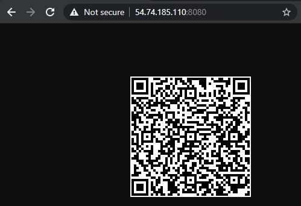
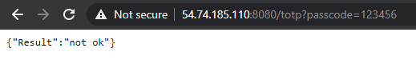
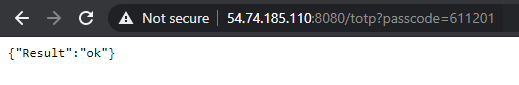
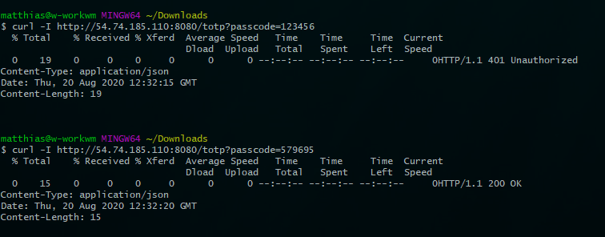

otpNOW [](https://travis-ci.org/mwiora/otpNOW) [](https://codeclimate.com/github/mwiora/otpNOW)
=========

One Time Passwords?
---------------
One Time Passwords (OTPs) are a mechanism to improve security over passwords alone. They provide a second factor of authentication against the first factor - which in most cases is some sort of password. 
While the password is static - and therefore vulnerable to be recorded or stolen, an OTP is each time a new one and can not be used twice (ONE time password :) )
There are basically two types of OTPs - HOTP (https://www.ietf.org/rfc/rfc4226.txt), which are counter-based and TOTP (https://tools.ietf.org/html/rfc6238), which are time-based.
The idea is that a server knows a secret and the user has a device that knows the secret too - while the OTP that is provided and exchanged is calculated out of that shared secret.

otpNOW?
---------------
Most solutions that use OTPs for authentication as a second factor want to verify the given OTP against a RADIUS Server. The RADIUS Server software itself has no possibility to verify the OTP as there is plenty of logic that the service must be able to handle, which in fact is no job for the RADIUS Server.
There are a few things that must be handled:
- mapping between user and it's secret
- one time password type (hotp/totp)
- backup codes (in case the otp device is lost)
- optional personal pins (before or afer the otp)

otpNOW provides such a layer as a rest-service - which provides the connecting-service between the RADIUS (or any other software) and the math that makes OTPs possible.

otpNOW uses the otp methods of the pquerna otp project, which is Apache 2 licensed too - great work btw!

supported integrations
---------------
- freeradius (exemplary setup guide)

requirements and getting started
---------------

* compile yourself (requirement: install go (minimum 1.15.x) as described here https://golang.org/doc/install)
```
go get github.com/pquerna/otp
go get github.com/mwiora/otpNOW/
cd $GOPATH/src/github.com/mwiora/otpNOW/
go build
./otpNOW
```

sample output of current version (debug off)
---------------

```
$ ./otpNOW
Issuer:       Example.com
Account Name: alice@example.com
Secret:       KY3DBQYFXZ4MYW6NSWEGPWTYD7BD4QPY
Writing PNG to qr-code.png....

Please add your TOTP to your OTP Application now!
```

sample interaction with the api
---------------

Feel free to access the API - the service is available up & running. Of course this server is only set up with the exemplary account, but for basic interaction with the API fair enough :)
Due to server restarts the Key and therefore the offered QR code might change from time to time. Take care of this when trying to validate a token against the API.

- Just calling the Server - the offered QR can be scanned by any authenticator app - e.g. Google Authenticator app
```
http://54.74.185.110:8080/
```


- next we could ask the server if a token is valid, which is certainly not
```
http://54.74.185.110:8080/token?passcode=123456
```


- next we could ask the server if a generated token is valid
```
http://54.74.185.110:8080/token?passcode=611201
```


- doing this by a commandline client - with some more information offering - it looks like:



checklist
---------------
basics
- [x] provide reference key to check if it's working
- [x] provide totp validation rest interface
- [ ] provide hotp validation rest interface
- [ ] user key management storage
- [ ] backup keys
- [ ] optional personal pin

integrations
- [x] freeradius guidance

nice2have
- [ ] implement test driven development

motivation
---------------
- software that is able to handle such OTP verifications is either a closed ecosystem and used by the large enterprises or seriously enterprise prised - in each case nothing you want to have when talking about security.